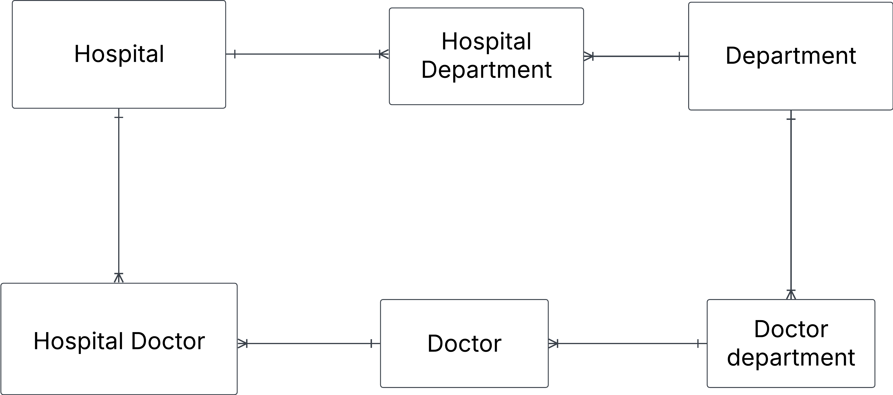

# Exercise 0

## 1. Hospital task

You have this json data, convert it into three tables: Hospital, Department and Doctor. Fill these tables with data. Do this manually and not programmatically.

````json
gg{
  "hospital": "Sjukhusstock",
  "address": "Drottninggatan 3, Stockholm",
  "departments": [
    {
      "name": "Kardiologi",
      "doctors": [
        { "id": 1, "name": "Dr. Abra Abrahamson" },
        { "id": 2, "name": "Dr. Erika Eriksson" }
      ]
    },
    {
      "name": "Neurologi",
      "doctors": [{ "id": 3, "name": "Dr. Sven Svensson" }]
    }
  ]
} 
```

### Solution

Approach
- identify entities 
- identify relationships and cardinalities
- create conceptual ERD
- create tables


**Initial naiv conceptual ERD**

````


**Intital tables**

Hospital 


|hospital_id|name        |adress            |
|-----------|------------|------------------|
|1          |sjukhusstock|Drottningsggatan 3|

Department 

|departanet_id|name      |
|-----------|------------|
|1          |kardiologi  |
|2          |Neuriliogi  |

Doctor

|doctor_id  |name               |
|-----------|-------------------|
|1          |Dr. Abra Abrahamson|
|2          |Dr. Erika eriksson |
|3          |Dr. Sven Svensson  |


Refined with bridge tables to reflect many-to-many relationships

 

HospitalDepartment


